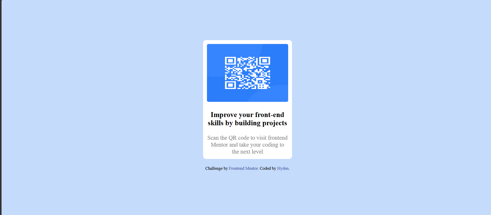

# Frontend Mentor - QR code component solution

This is a solution to the [QR code component challenge on Frontend Mentor](https://www.frontendmentor.io/challenges/qr-code-component-iux_sIO_H). Frontend Mentor challenges help you improve your coding skills by building realistic projects. 

## Table of contents

- [Overview](#overview)
  - [Screenshot](#screenshot)
  - [Links](#links)
- [My process](#my-process)
  - [Built with](#built-with)
  - [What I learned](#what-i-learned)
  - [Useful resources](#useful-resources)
  - [AI Collaboration](#ai-collaboration)
- [Author](#author)
- [Acknowledgments](#acknowledgments)

## Overview

### Screenshot

### Links

- Solution URL: [Add solution URL here](https://your-solution-url.com)
- Live Site URL: [Add live site URL here](https://your-live-site-url.com)

## My process

### Built with

- Semantic HTML5 markup
- CSS custom properties
- Flexbox
**Note: These are just examples. Delete this note and replace the list above with your own choices**

### Continued development

I don't think i'm using the right tags the right way, i aspire to be able to right professional code using the right semantic tags for HTML and the right/perfect css style property.

**Note: Delete this note and the content within this section and replace with your own plans for continued development.**

### Useful resources 

**(https://www.frontendmentor.io/solutions/qr-code-component-with-flexbox-QBaOVoYUyu)**

### AI Collaboration

i just ask it for a guide on how to get started,then i asked how it was looking on every progress i made.

-I used vs Code GitHub Copilot
-I used it to have a start-up
- it was ok generally,i don't think anything bad went wrong

**Note:Vs code copilot just guided me how i should start,not much impact from the AI....just a short guide**

## Author

- Website - [Hyden](https://www.your-site.com)
- Frontend Mentor - [Hydentrix101](https://www.frontendmentor.io/profile/Hydentrix101)

**Note: I have created first ever project of frontend mentor,this project i did really helped me rememberhow to make good use of basic css elements i've learnt in the past.It was a good active recall exercise.**

## Acknowledgments

https://www.frontendmentor.io/solutions/qr-code-component-with-flexbox-QBaOVoYUyu
her solution to the challenge gave me the instant drive and right idea on usomg flex box to do the layout of the web.

